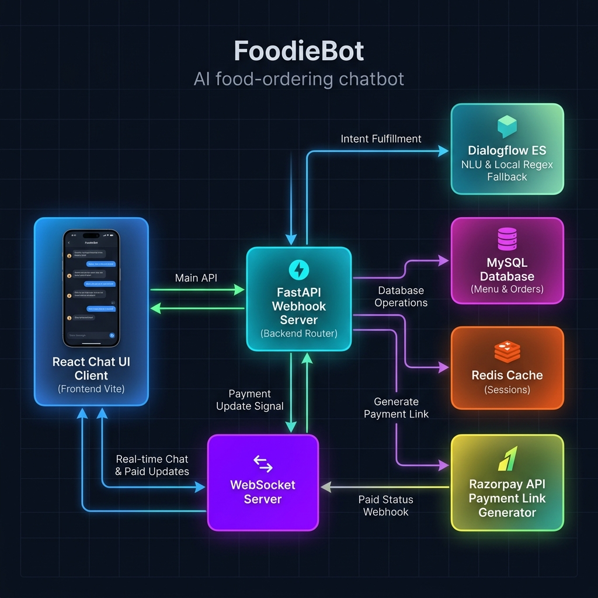

<div align="center">

# 🍔 FoodieBot — Asynchronous Conversational Commerce Engine

[](https://gleaming-halva-bab9c6.netlify.app)
[](https://foodchatbot-production.up.railway.app/health)
[](https://github.com/dhanusharer/food_chat_bot)
[](https://python.org)
[](https://fastapi.tiangolo.com)
[](LICENSE)

<br/>

> **An enterprise-grade, event-driven conversational food ordering platform** powered by Google Dialogflow ES, FastAPI, Redis, and MySQL. It features cryptographically secured payment webhooks, real-time status synchronization over WebSockets, and a premium React dark-mode client.

<br/>



</div>

---

## 🌟 Architectural Highlights & Technical Depth

Unlike standard "toy" conversational agents, **FoodieBot** represents a distributed, state-synchronized commerce architecture designed to handle concurrent operations, network failovers, and secure financial callbacks.

### 1. 🛡️ Cryptographic Payment Security (HMAC-SHA256 Webhook)
The payment gateway relies on Razorpay API links. Security is enforced using strict **HMAC-SHA256 cryptographic signature validation**:
* When a payment event succeeds, Razorpay redirects to the `/payment/callback` endpoint.
* To prevent spoofing attacks (e.g. visiting the callback endpoint directly to confirm unpaid orders), the backend uses a secure hash message authentication code (`hmac` with `sha256`) keying off the local `RAZORPAY_KEY_SECRET`.
* The callback payload is verified byte-by-byte using `hmac.compare_digest` to protect against timing-attack vectors.

### 2. ⚡ Real-Time WebSocket Synchronization (Redis State Coordinator)
When order state transitions in the database (e.g., from `pending` to `paid`), the backend coordinates a zero-latency push to the active browser session:
* At checkout, the backend maps the generated database `order_id` to the active client `session_id` inside Redis.
* A central `ConnectionManager` class in FastAPI tracks active browser client connections via HTML5 WebSockets.
* When the secure payment callback succeeds, the backend queries Redis for the matching session, extracts the socket reference, and triggers an asynchronous JSON push event.
* The React client instantly advances the visual tracking stepper without requiring manual refreshes.

### 3. 🧠 Typos & Plural Resolution (Fuzzy Matching Engine)
Conversational inputs like `"2 burgurs and 1 pizaa"` fail exact matches. The backend uses the **Levenshtein Distance** algorithm via `thefuzz`:
* The DB helper fetches the menu catalog dynamically and computes matching scores against user tokens.
* If a parsed item exceeds the configurable confidence threshold (`FUZZY_MATCH_THRESHOLD` default `70%`), it is resolved to its precise database entry.
* This is paired with regular expression parsing to infer quantities (e.g., defaulting to `1` when no digit is provided).

### 4. 🔌 Fault-Tolerant Cache Fallback (MockRedis Pattern)
To ensure local testing works seamlessly without requiring local Redis installations:
* The cache initialization in `session_manager.py` catches socket connection errors dynamically with a `socket_connect_timeout`.
* If a local Redis service is unreachable, it seamlessly swaps the client reference with an in-memory dictionary-based `MockRedis` implementation.
* The application continues functioning correctly in RAM, guaranteeing zero configuration friction for local runs.

---

## ✨ Features

### 🤖 Conversational Intelligence
- **Contextual Dialog Routing:** Multi-turn intent tracking powered by Google Dialogflow ES.
- **Fuzzy Item Parsing:** TYPO correction maps `"cold cofee"` to `"Cold Coffee"` instantly.
- **NLP Fallback Controller:** A local regex and fuzzy matching fallback parses and completes orders in the event of Dialogflow API quota limits or network dropouts.

### 🛒 End-to-End Commerce Lifecycle
- **Unified Cart Additions:** Add multiple distinct items in a single sentence (e.g. `"2 fries and a veg burger"`).
- **Interactive Cart UI:** Inline cards display item subtotals, catalog images, and decrement buttons.
- **Visual Invoices:** The checkout handler replaces generic text URLs with a styled receipt card pointing directly to the secure payment link.
- **Live Stepper Tracker:** An animated progress bar tracks `Placed` ➔ `Paid` ➔ `Preparing` ➔ `Delivered` in real-time.

---

## 🛠️ Technology Stack

| Component | Technology | Rationale |
|---|---|---|
| **API & Routing** | FastAPI (Python 3.11) | High performance, native async support, type-safety, and automatic OpenAPI generation. |
| **NLU Engine** | Google Dialogflow ES | Highly reliable intent classification and entity extraction. |
| **Primary Database** | MySQL 8.0 | Strong relational integrity for orders, line items, and menu matching. |
| **Cache & State** | Redis 7.0 / In-Memory | Sub-millisecond session state storage with automatic TTL cart expiration. |
| **Payment Gateway** | Razorpay SDK | Robust, developer-friendly UPI and card payment interface. |
| **Real-time Sync** | WebSockets (HTML5) | Full-duplex communication channel for live status updates. |
| **Frontend UI** | React 18 & Vite | Fast, modular component structure with instant Hot Module Replacement. |

---

## 🏛️ Project Directory Structure

```text
food_chat_bot/
├── main.py              # FastAPI entry point (WebSockets, chat routing, payment callback)
├── handlers.py          # Intent controller logic (add/remove from cart, checkout, tracker)
├── db_helper.py         # MySQL connection pooling, database queries, fuzzy matching
├── session_manager.py   # Redis cart cache coordinator with MockRedis in-memory fallback
├── payment_helper.py    # Razorpay SDK wrappers and HMAC-SHA256 signature verification
├── init.sql             # Relational schema setup and seed catalog menu items
├── Dockerfile           # Multi-stage production container configuration
├── docker-compose.yml   # Multi-service local environment configuration (FastAPI, Redis, MySQL)
├── requirements.txt     # Python dependencies
├── .env.example         # System environment variables template
├── .agent/
│   └── skill.md         # Custom AI Agent instructions for standardized Draw.io flowcharts
└── frontend/
    ├── src/
    │   ├── App.jsx      # Core React layout (WebSocket listener, composer, chat cards)
    │   └── App.css      # Dark mode variables and premium glassmorphism design system
    ├── vite.config.js   # Vite server setup with HTTP/WebSocket proxy configurations
    └── package.json     # Node.js dependencies and script shortcuts
```

---

## 🗄️ Database Schema

The database relies on strict foreign key constraints to represent order line items while maintaining menu catalog prices:

```sql
-- Food items catalog
CREATE TABLE food_items (
    id    INT AUTO_INCREMENT PRIMARY KEY,
    name  VARCHAR(100) NOT NULL UNIQUE,
    price DECIMAL(10, 2) NOT NULL
);

-- Orders with payment links and transaction reference ids
CREATE TABLE orders (
    id              INT AUTO_INCREMENT PRIMARY KEY,
    status          VARCHAR(50) NOT NULL DEFAULT 'pending',
    payment_id      VARCHAR(100) DEFAULT NULL,
    payment_link_id VARCHAR(100) DEFAULT NULL,
    created_at      TIMESTAMP DEFAULT CURRENT_TIMESTAMP
);

-- Order line items mapping to catalog items
CREATE TABLE order_items (
    id          INT AUTO_INCREMENT PRIMARY KEY,
    order_id    INT NOT NULL,
    item_id     INT NOT NULL,
    quantity    INT NOT NULL,
    total_price DECIMAL(10, 2) NOT NULL,
    FOREIGN KEY (order_id) REFERENCES orders(id),
    FOREIGN KEY (item_id)  REFERENCES food_items(id)
);
```

---

## 🚀 Local Installation & Execution

### Prerequisites
- Python 3.11+
- Node.js 18+
- MySQL Server (if running natively)

### Option A: Native Running (Fastest Local Test)

If you already have a local MySQL server running, you can launch natively without Docker. The system will automatically fall back to an in-memory database model for Redis:

1. **Configure Environment Variables:**
   ```bash
   cp .env.example .env
   # Open .env and adjust DB_HOST=127.0.0.1, REDIS_HOST=127.0.0.1, DB_PASSWORD, etc.
   ```

2. **Initialize Python Virtual Environment:**
   ```bash
   python -m venv .venv
   .venv\Scripts\activate      # On Windows
   source .venv/bin/activate    # On macOS/Linux
   pip install -r requirements.txt
   ```

3. **Start FastAPI Backend:**
   ```bash
   uvicorn main:app --port 8000
   ```

4. **Start React Frontend:**
   In a separate terminal:
   ```bash
   npm install                  # Install frontend dependencies
   npm run dev                  # Start Vite development server
   ```
   Open `http://localhost:5173` in your browser.

---

### Option B: Docker Compose (All Services Containerized)

1. Ensure **Docker Desktop** is running.
2. Run the following command in the project root:
   ```bash
   docker compose up --build
   ```
3. In a separate terminal, start the frontend development server:
   ```bash
   npm run dev
   ```

---

## 🔧 Configurable Environment Variables

Create a local `.env` file in the root directory:

```env
# Database Credentials
DB_HOST=127.0.0.1
DB_PORT=3306
DB_USER=root
DB_PASSWORD=your_root_password
DB_NAME=chatbot_db

# Redis Caching (Uses 127.0.0.1 locally, automatically falls back to in-memory if offline)
REDIS_HOST=127.0.0.1
REDIS_PORT=6379
REDIS_PASSWORD=

# Google Dialogflow Credentials
DIALOGFLOW_PROJECT_ID=your-project-id
GOOGLE_CREDENTIALS_JSON={"type": "service_account", ...}

# Razorpay Credentials
RAZORPAY_KEY_ID=rzp_test_xxxxxx
RAZORPAY_KEY_SECRET=xxxxxxxxxxxx

# Business Logic Configurations
CART_TTL_SECONDS=1800
MAX_ITEM_QUANTITY=20
FUZZY_MATCH_THRESHOLD=70
```

---

## 🤝 Dialogflow Intent Mapping

The FastAPI webhook routes requests dynamically based on incoming intent descriptors resolved by the Dialogflow API:

| Intent | Trigger Expression | Internal Action Handler |
|---|---|---|
| `show.menu` | *"show menu"*, *"whats on the menu"* | `handle_show_menu()` |
| `order_add` | *"2 burgers"*, *"add 1 cold coffee"* | `handle_order_add()` |
| `order.remove` | *"remove veg burger"* | `handle_order_remove()` |
| `cart.summary` | *"show cart"*, *"my items"* | `handle_cart_summary()` |
| `order.complete` | *"confirm order"*, *"checkout"* | `handle_order_complete()` |
| `track.order` | *"track order 5"*, *"check status"* | `handle_track_order()` |
| `order.cancel` | *"cancel my order"* | `handle_cancel_order()` |

---

## 👨‍💻 Creator

**Dhanush A G**

[](https://linkedin.com/in/dhanusharer)
[](https://github.com/dhanusharer)

---

## 📄 License

MIT License — free for educational and commercial modifications.

<div align="center">

**⭐ Star this repository if you found it useful!**

</div>